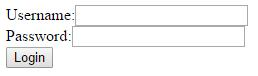

## Objectives of the week

This week you'll step to a higher level of software development.
You will learn about creating server side and web applications with Java servlets.
Your next topic will be how to describe a client side user interface with HTML,
but usually there is no web application without knowing HTTP protocol.

--------

--------

## Init

First of all to run server side Java application you'll need a server first, of course.
For this task you will need to use Apache Tomcat server. It's free, you can download it here:  
http://xenia.sote.hu/ftp/mirrors/www.apache.org/tomcat/tomcat-7/v7.0.68/bin/apache-tomcat-7.0.68-windows-x64.zip  
Unzip it anywhere and you're done. The next steps are optional, but highly recommended.  
Many IDEs support creating enterprise applications.
If you prefer Eclipse, please download **Eclipse IDE for Java EE Developers**
(not **Eclipse IDE for Java Developers**, which you used until now !!!)  
You can download it here:
http://www.eclipse.org/downloads/download.php?file=/technology/epp/downloads/release/mars/2/eclipse-jee-mars-2-win32-x86_64.zip  
In this version of Eclipse there is a new perspective (JavaEE)
and now you can create Dynamic Web Projects in Package Explorer.
The other cool thing is you can add Tomcat to Servers view
and after this you won't have to deploy applications by hand.

--------

--------

## Login

In this task you will have to create a simple login application.
The GUI is a simple HTML page where you can write in a username and a password (as a password type field)
and you can push a button where you can send the written data.

If the username and password are correct, redirect to a profile page where the application greets the user,
show something like this: 'Welcome <username> ! Have a nice day !'
(of course <username> should be replaced with the username typed in the login page).  
If the username and password are incorrect, show a message on the login page like
'Bad username or password ! Permission denied' .
If user tries to login while she/he is already logged in, warn the user about it
and let her/him log out putting a Logout button on the page.
Put this button also onto the profile page.  
If user wants to reach the profile page while she/he is not logged in,
rediect her/him to the login page and warn her/him it's necessary to be logged in.  
* user interface has to be described in HTML
* choose a predefined username and password and let login only with these username and password, otherwise warn the message above Bad username or password ! Permission denied'  and redirect to login page
* pages should have a form (tag) where it is necessary
* method type of forms is POST
* the progress is managed on server side using **javax.servlet.http.HttpServlet**
* user data has to be stored in session (**javax.servlet.http.HttpSession**)

--------

--------

## Hints

* javax.servlet.http.HttpServlet
* javax.servlet.http.HttpSession
* web.xml
* HTML
* HTTP protocol
* Apache Tomcat

--------

--------

## How to prepare for week B

Create a small demo for your work.  
Collect all the topics what you have learnt this week.  
Define some questions related to Java servlets and web development.
